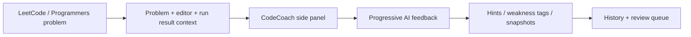
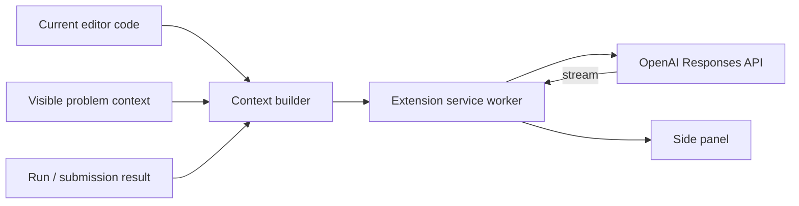

# CodeCoach

CodeCoach is a Chrome extension for coding-interview practice on LeetCode and Programmers. It adds progressive hints, debugging help, submission history, weakness tracking, and review scheduling directly beside the problem page.

The main design goal is to help with the next step without immediately giving away a complete solution.

**Published on the Chrome Web Store:** [Install CodeCoach](https://chromewebstore.google.com/detail/codecoach/ebbhlcklphnijoajejbpddlbdpaiphjp)  
**Privacy policy:** [CodeCoach Privacy Policy](https://tkim602.github.io/CodeCoach/privacy-policy.html)

## Why I built it

General-purpose coding assistants are useful for finishing code, but that is not always what I want while preparing for coding interviews. If the assistant reveals the whole approach too early, the practice session becomes much less useful.

CodeCoach is built around a different interaction: read the code I have already written, understand the current problem context, and give only as much help as I ask for. The extension then keeps track of the mistakes and topics that repeatedly show up so those problems can be reviewed later.

## Demo

https://github.com/user-attachments/assets/5a7c556c-070c-401c-8471-b8f38aa0eabf

The full walkthrough shows CodeCoach running on a real LeetCode problem, from contextual hints and debugging guidance through submission tracking and review features.

## Practice flow



The extension runs only on supported practice pages. It reads the visible problem context, current editor code, selected text, and visible run or submission result when those are needed for a feature.

## Core features

### Progressive hints

Hints have three levels so the user controls how much of the approach is revealed:

- **Light hint** - a small nudge without naming the solution strategy
- **Direction hint** - points toward the relevant algorithm, data structure, or reasoning shift
- **Specific hint** - gives a concrete next step without returning a full accepted solution

The no-full-solution behavior is enforced in two places. Prompt instructions restrict complete answer code, and the side panel also checks model metadata and generated output before displaying hint-style responses.

### Code and debugging tools

CodeCoach can work from the code currently open in the practice editor and provide:

- full approach and complexity analysis
- selected-line explanations
- debugging help using visible errors or failing test output
- next-code-step suggestions
- before/after code comparison
- wrong-answer study-note generation

### Submission snapshots

Visible pass/fail results can automatically create local code snapshots. Each snapshot records the current code, language, result state, elapsed practice time, and available run-result context.

Duplicate result events are filtered so the same submission is not repeatedly stored when page events fire more than once.

### Weakness tracking

AI responses include structured learning metadata rather than only free-form text. CodeCoach records problem-type, caution-point, and implementation tags such as:

- binary search boundaries
- BFS / DFS traversal
- sliding window
- data-structure selection
- edge cases
- off-by-one mistakes
- time and space complexity

Repeated learning signals are aggregated into the History view so the user can see which topics keep causing trouble.

### Review planner

Problems can be added to a review schedule based on their result and study history. Review items can be completed, postponed, or removed, and failed attempts receive higher review priority than routine successful attempts.

### Timed practice

A per-problem timer uses Chrome alarms and notifications so a practice session can be run under a fixed time limit without keeping the side panel open the entire time.

### Local history and export

CodeCoach stores problem sessions, hint events, notes, code snapshots, review metadata, and learning events in Chrome extension storage. History can be searched and exported as Markdown for later review.

## Engineering highlights

### Working with real coding editors

LeetCode and Programmers do not expose the same editor or page structure. CodeCoach uses site-specific content scripts plus several editor fallbacks to recover the current source code and problem context.

The current implementation can inspect Monaco, Ace, CodeMirror, and regular textarea/DOM fallbacks when available. It also normalizes platform-specific run/submission states so the rest of the extension can work with one internal context format.

### Streaming AI responses

AI requests use the OpenAI Responses API with streaming enabled. The background service worker reads the SSE stream and forwards incremental output to the side panel so hints appear as they are generated instead of waiting for the full response.



### Learning metadata

The assistant returns hidden structured metadata alongside the visible response. CodeCoach validates and normalizes those tags before storing them, which lets the extension build weakness summaries and review history without trying to infer everything later from raw chat text.

### Local-first storage

Cloud sync is **off by default**. The OpenAI API key, saved notes, code snapshots, settings, and study history are stored in `chrome.storage.local` unless the user enables an optional sync feature.

Optional Firebase Authentication supports Google or email/password sign-in. When cloud sync is enabled, selected learning metadata such as hint events, weakness categories, review schedules, problem identifiers, and timestamps can be synchronized through Firestore. Saved code snapshots and wrong-answer note bodies remain local in the current release.

## Privacy model

CodeCoach uses a bring-your-own-key model for AI requests.

```text
Browser extension -> OpenAI API
                 -> optional Firebase / Google services
```

There is no CodeCoach-operated backend proxy for OpenAI requests. The user's API key and request are sent from the extension directly to OpenAI over HTTPS, and OpenAI requests are made with `store: false` in the current implementation.

CodeCoach does not sell user data or use it for advertising. It does not run on arbitrary websites; host permissions are limited to supported coding-practice pages and the API endpoints required for OpenAI and optional Firebase features.

The full data-handling description is in the [privacy policy](https://tkim602.github.io/CodeCoach/privacy-policy.html), hosted from this repository.

## Supported platforms

- [LeetCode](https://leetcode.com/problemset/)
- [Programmers / 프로그래머스](https://school.programmers.co.kr/learn/challenges)

The current Chrome Web Store release is version `1.0.0`.

## Tech stack

- Chrome Extension Manifest V3
- JavaScript, HTML, CSS
- Chrome Side Panel API
- Chrome Storage API
- Chrome Scripting API
- Chrome Alarms and Notifications APIs
- Chrome Identity API
- OpenAI Responses API
- Firebase Authentication
- Firebase Firestore for optional metadata sync

## Project structure

```text
CodeCoach/
├── manifest.json
├── src/
│   ├── auth/            # sign-in UI
│   ├── background/      # service worker, AI streaming, timers
│   ├── content/         # LeetCode / Programmers page integration
│   ├── options/         # extension settings
│   ├── shared/          # prompts, storage, Firebase, taxonomy
│   └── sidepanel/       # main product UI and feature controllers
├── assets/
├── landing/             # React + TypeScript landing page source
├── index.html           # English landing entry
├── ko/index.html        # Korean landing entry
├── docs/                # generated GitHub Pages output and store docs
└── vendor/
```

## Install

### Chrome Web Store

Install the published extension from the [Chrome Web Store](https://chromewebstore.google.com/detail/codecoach/ebbhlcklphnijoajejbpddlbdpaiphjp).

### Local development

```bash
git clone https://github.com/tkim602/CodeCoach.git
cd CodeCoach
```

Then:

1. Open `chrome://extensions`.
2. Enable **Developer mode**.
3. Select **Load unpacked**.
4. Choose the repository folder.
5. Open a supported LeetCode or Programmers problem.
6. Click the CodeCoach extension icon to open the side panel.

An OpenAI API key can be added from the extension settings for AI features.

### Landing page development

The public English and Korean pages share one React + TypeScript application. Vite builds both routes into `docs/`, which keeps the existing GitHub Pages URLs unchanged.

```bash
npm install
npm run dev
```

Before committing landing-page changes, regenerate the Pages output and run the checks:

```bash
npm test
npm run typecheck
npm run build
```

## Scope

CodeCoach is a practice tool, not an answer generator for active assessments. Its coaching prompts explicitly avoid complete accepted code by default and disable assistance for contests, assessments, certifications, hiring tests, private tests, and similar evaluation settings.

CodeCoach is an independent project and is not affiliated with LeetCode, Programmers, OpenAI, Google, or their parent companies.
